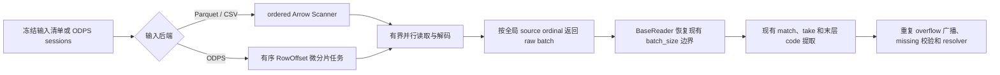

# SID 碰撞工具 32 核利用方案

## 1. 结论

当前工具无法通过设置 `OMP_NUM_THREADS=32` 或继续调整单个 Parquet Reader 的 `use_threads` 来占满 32 核。实测 `use_threads=True` 后平均仍约为 1.00 个逻辑核，因为 42 GiB 的 `candidate_codes` 实质上是一个宽 Parquet 叶子列，Arrow 的“多列并行”没有足够的列级并行度。

推荐分三阶段实施，并覆盖当前 CLI 明确支持的 Parquet、CSV 和 ODPS 三种输入：

1. **先建立统一的有序读取层。** Parquet 和 CSV 复用 Arrow ordered Dataset Scanner；ODPS 在同一批 read session 上并发读取连续 RowOffset 微分片。三者都向主线程返回原始输入顺序的 RecordBatch，再复用现有 rechunk、lookup 和 candidate 处理。
1. **计算阶段优先复用 PyTorch CPU。** 分别测量 lookup、plan、resolved grouping、resolve 和 write；对已知存在的单线程 `np.lexsort`/`np.searchsorted` 候选内核，先分段计时，再 A/B 验证 PyTorch 多线程 stable sort/search，而不是直接引入新库或多进程。
1. **GPU 只作为独立后续 PoC。** 当前最大 candidate 热点是 Reader/Arrow/ODPS I/O 与解码，PyTorch GPU 不能直接加速；当前 CUDA 环境也不可用。只有 CPU Reader 和 Torch 方案仍不能满足目标时，再评估 cuDF 或 GPU 分区排序。

现有 96 row-group 热缓存基准只适用于 Parquet：Arrow CPU pool 上限为 16 的配置最快，原始扫描达到 10.58 倍、平均使用 13.11 核。CSV 必须按单文件和多文件分别测量；ODPS 还会受 Storage API quota、网络和服务端限流影响，不能套用 Parquet 的最优值。统一参数只表达目标读取并行度，各后端应独立限流并以 wall time 选型。

本报告只提供设计和实验计划，没有修改生产代码。

## 2. 已知运行事实

下表是 42.86M、`rate_only` 的受控 Parquet 实验：

| 项目                   |                                                     实测值 |
| ---------------------- | ---------------------------------------------------------: |
| CPU                    |                  32 个物理核，单 socket、单 NUMA、无超线程 |
| 内存                   |                                           128 GiB，无 swap |
| 存储                   |                            NFS v3，挂载自 `192.168.0.31:/` |
| 输入行数               |                                                 42,864,043 |
| Parquet row group      |                                 1,312 个，每组约 32,768 行 |
| `candidate_codes` 宽度 |               每行 600 个 `int64`，即 200 个三层 candidate |
| Parquet 编码页大小     | codec 后 41,895,630,133 字节，codec 前 42,147,374,634 字节 |
| `id` 大小              |                                             压缩约 0.38 GB |
| overflow 行数          |                                1,403,836，约占输入的 3.27% |
| 最终版本总耗时         |                                                 434.214 秒 |
| candidate 扫描估算耗时 |                                         316.7 秒，约占 73% |
| 其余阶段合计           |                                                约 117.5 秒 |
| 进程 RSS               |                                                  约 11 GiB |

42.1 GB 是移除压缩 codec 后、仍经过 RLE/bit-pack 等 Parquet 编码的 page bytes，不是 Arrow 中 `600 × int64` 的物化大小。两者接近只能说明额外 codec 的收益较小，不能据此判断信息熵。热缓存时主要限制是解码、物化和内存带宽；冷缓存时还会受到 NFS 服务端和网络吞吐限制。

`experiments/history.log` 还记录了一次 255,172,938 行完整输出：

| 日志区间                                            |   约耗时 | 可确认结论                                              |
| --------------------------------------------------- | -------: | ------------------------------------------------------- |
| candidate 第二遍扫描                                |  69 分钟 | 全流程最大热点，约 60K 行/s                             |
| 首遍结束到 candidate 首个进度                       |  14 分钟 | 混合 plan、lookup、Reader 初始化和首批读取，需拆分计时  |
| original grouping 结束到 resolved grouping 首个进度 | 8.5 分钟 | 主要包含 resolved grouping 构造和全量 `np.searchsorted` |

因此“Reader 并行”和“替代 NumPy”不是二选一：前者解决最大 candidate 热点，后者用于验证 plan/grouping 计算空窗中的单线程候选内核。

## 3. 当前为什么只有一个核

`CollisionResolutionRunner.run()` 当前按顺序执行：

1. `_load_codes()`：无参调用 `reader.to_batches()`，只启用 `worker_id=0, num_workers=1` 这一个逻辑 Reader worker；后端仍可能使用 Arrow 内部线程。
1. `prepare_collision_plan()`：单线程计算 band、稳定 hash、全局 `np.lexsort` 和 bucket rank。
1. `_load_candidate_last_codes()`：再次无参调用 `reader.to_batches()`，在单一 Python 循环中完成 ID 匹配、candidate 选择和写入。
1. `CollisionResolver.resolve()`：按 overflow 顺序执行贪心 first-fit。
1. 非 `rate_only` 模式下顺序写出 map 和 grouping。

仓库初始化时默认设置 `OMP_NUM_THREADS=1`，但这不是 candidate 扫描只有一个核的根因。该变量不控制 PyArrow Reader，也不会自动并行 `np.lexsort`、pandas `Index.get_indexer` 或 Python first-fit。未来 Torch CPU 路径可以在 CLI 启动阶段显式设置 intra-op 线程预算，但仅把环境变量改成 32 仍不能解决 Reader 分片，还可能与 Arrow/ODPS 外层并行形成过订阅。

## 4. 可以复用的框架能力

| 现有能力                                        | 可复用方式                                    | 限制                                                        |
| ----------------------------------------------- | --------------------------------------------- | ----------------------------------------------------------- |
| `BaseReader.to_batches(worker_id, num_workers)` | 作为统一的 Reader 分片契约                    | SID 当前没有传入 worker 参数                                |
| `BaseReader._arrow_reader_iter()`               | 将有序 raw batch 重切回统一 `batch_size`      | 当前是受保护方法，需要收敛为可复用入口                      |
| `calc_slice_intervals()`                        | 将全局行序列切为连续、无重叠区间              | 边界可能落在 row group 内，邻接任务会重复解码边界 row group |
| `ParquetReader.to_batches()`                    | 单个大文件也能按全局连续行范围分片            | 尚无同一 Reader 被多线程并发调用的正式测试                  |
| `pyarrow.dataset.Scanner`                       | 并行扫描 Parquet/CSV fragments，并有序返回    | CPU pool 是进程全局配置；需显式冻结和测试 fragment 顺序     |
| `OdpsReader.to_batches()`                       | 对固定 Storage API session 按 row offset 分片 | 多 table/session 的有序归并和客户端并发安全需单独验证       |
| `CsvReader.to_batches()`                        | 已通过 Arrow Dataset Scanner 读取文件         | worker 模式按文件轮转，会改变多文件汇总顺序                 |
| dynamic-embedding 初始化工具                    | 可借鉴 worker 生命周期和有界 Queue 背压       | 使用多进程且无序汇聚，不能直接用于 SID                      |
| hitrate 工具                                    | 展示 rank 到 Reader worker 的映射             | SID 有全局容量状态和单一输出，不能直接套用 torchrun         |

`ParquetReader` 初始化时已有一个 `ThreadPoolExecutor(os.cpu_count())`，但它只并行读取文件 metadata，不会并行正文扫描。PyArrow 17 的 C++ `ScanBatches()` 接口明确约定 batch 按 Dataset fragment 顺序到达，Python `Scanner.to_batches()` 直接使用该接口，因此 Parquet 和 CSV 应优先复用 Scanner。ODPS 不走 Arrow Dataset，需要复用现有 RowOffset、retry 和 session refresh 能力，另加有序协调。

## 5. P0：统一的有序读取层

### 5.1 推荐数据流



具体设计：

1. 一次运行只使用一种 Reader 类型。逗号路径、glob、多文件、多 ODPS table/partition 都可以属于同一后端；混合 Parquet、CSV、ODPS 的异构输入不在当前 CLI 能力内，不应在本次性能重构中隐式扩展。
1. 第一次读取前冻结输入顺序：本地文件记录展开后的路径和必要 metadata；ODPS 记录 `(input_path, session_id, record_count)`。两遍扫描都必须保持同一逻辑 source 顺序，输入文件或 ODPS 分区在运行期间应视为不可变。
1. 每个后端把可并行单元映射为单调 source ordinal：Parquet 为 `(file, row_group)`，CSV 为 `(file_index, Scanner batch ordinal, row)`，ODPS 为 `(input_path, session, row_offset)`。CSV parser block 只是 Arrow 内部粒度，不作为外部可编号的分片契约。
1. 后端只负责有界读取、解码和有序返回 raw RecordBatch，不并发写 `candidates`、`seen` 或输出文件。
1. raw batch 统一进入与 `BaseReader._arrow_reader_iter()` 等价的 rechunk，恢复现有逻辑 `batch_size`；之后继续复用 `Index.get_indexer`、`pc.take`、`_candidate_last_matrix`、进度和业务校验。
1. candidate 变换和矩阵写入首版保持单线程，完成后继续执行现有 duplicate broadcast、missing 检查和 resolver。

统一层只约束“冻结顺序、有界并行、有序 raw batch”三个行为，不强迫不同后端共享同一底层实现。这样 collision runner 不需要理解 row group、CSV parser block 或 ODPS session，也不会把 Parquet 专属优化硬套到其他格式。

### 5.2 并行度配置

- 对外只增加格式无关的 `input_read_parallelism=W`。Parquet/CSV 将它映射到 Arrow CPU pool 目标上限；ODPS 将它映射为最大并发 RowOffset 请求。Arrow 的 W 不是严格的 I/O 线程或 fragment 并发上限，也不保证使用 W 个 CPU 核。
- `pa.set_cpu_count(W)` 是进程全局配置。Parquet/CSV 扫描前应记录原值并在 `finally` 中恢复；ODPS 不应修改 Arrow 全局线程池。
- readahead、ODPS range 行数和在途任务数属于后端内部内存/限流策略，第一版不增加更多客户参数。W=1 必须是统一的结果安全回退，但 Scanner `use_threads=True` 时不应将它表述为绝对串行。
- 默认值在三种后端分别完成基准前保持 1；未来可以为 `auto` 维护后端默认值，但不能把 Parquet 的 W=16 直接作为 CSV 或 ODPS 默认值。

### 5.3 后备方案

Parquet/CSV 的 ordered Scanner 无法扩展或内存无法受控时，可以回退显式 fragment `ThreadPoolExecutor`；ODPS 客户端并发安全、quota 或 session 行序未通过验证时，直接回退 W=1。进程池不是首选，因为它需要复制或 IPC 传输宽 Arrow buffer、ID lookup 和 candidate 矩阵。

只有分段计时证明 `get_indexer`、`take` 或末层提取成为下一瓶颈时，才考虑第二级计算并行。此时必须先验证共享 `pd.Index` hash engine 的线程安全，或使用线程本地 Index；不能用一个全局锁把 lookup 再次串行化。

## 6. 必须保持的结果语义

并行化不能只保证 collision stats 相同，必须保持每一行最终 SID 相同。

### 6.1 重复源 ID

目标语义是：同一 item ID 在源数据中多次出现时，物理输入顺序中最后一次出现的 candidate 生效，然后广播给所有重复 overflow 行。最后一次记录即使是 retained/non-overflow 行，也必须为相同 overflow ID 提供 candidate。

Scanner 的有序 batch 保留跨 batch 的覆盖顺序；同一 batch 内多个 source row 命中同一 target 时，不能依赖 NumPy 重复高级索引赋值的隐式顺序。实现应携带全局 source row，只保留每个 target 最大 source row 后再写代表位置，最后执行现有 duplicate broadcast。

### 6.2 文件与任务顺序

全局顺序由后端定义：Parquet 是文件、row-group、行；CSV 是文件和 parser 产生的行；ODPS 是 input path、read session、RowOffset。多文件不能用 `files[worker_id::num_workers]` 后再按 worker 汇总，因为这会把 `0,1,2,3` 变成 `0,2,1,3`；ODPS 也不能按 worker 汇总多个 session 的区间。

### 6.3 错误与取消

- candidate 字段、宽度和跨 batch top-k 等现有业务校验仍在有序 raw batch 完成 rechunk 后执行，并保持“只校验命中 candidate 行”的当前范围，不能无意扩展为全表校验。
- Arrow `ScanBatches()` 保证成功 batch 的返回顺序，但没有承诺多个并发读取错误按最早 fragment 抛出；ODPS future 也可能乱序失败。读取异常应补充 file/row-group 或 table/session/offset 上下文，保证不创建部分输出，并在 `finally` 中释放资源和恢复全局配置。
- 进度只在有序 batch 进入现有处理点时由主线程更新；后台 Scanner/ODPS 任务不输出进度，因而调度顺序不会改变日志计数。

## 7. 内存和背压设计

本数据每个输入行包含 600 个 `int64` candidate，原始 payload 为 4,800 字节；命中后保留 200 个末层 code，即 1,600 字节。最终 overflow candidate 矩阵约为：

```text
1,403,836 × 200 × 8 ≈ 2.25 GB
```

各后端的原始并发单元不同：

- **Parquet：** 一个 32,768 行 row group 物化 candidate 约 150 MiB；4、8、16 个并发 fragments 约为 0.59、1.17、2.34 GiB。
- **CSV：** 现有 parser block 为 64 MiB，但字符串解析后会扩展为 Arrow buffers，再由 `_candidate_last_matrix` 物化为整数；不能用文件字节数直接估算。通过 Scanner readahead 和实测 `batch.nbytes`、RSS 控制。
- **ODPS：** 若一个 RowOffset 微分片取 20,000 行，candidate payload 约 91.6 MiB；在 `2W` 个完成或在途分片均持有 buffer 的最坏估算下，W=4/8/16 分别约为 0.72/1.43/2.86 GiB，不含网络压缩 buffer。

Arrow Scanner 自带有界 readahead；ODPS 使用同时限制任务数和完成结果数的滑动窗口，初始不超过 `2W`。三种后端的 decoded buffer 初始目标均为不超过 4 GiB，并记录 RSS 与 Arrow allocated bytes；不要假定峰值是 raw payload 的固定倍数。

`batch_size` 只控制 I/O batch 和公共 rechunk，不等于并行度。客户侧只需看到 `input_read_parallelism`；readahead、ODPS range 行数和字节背压作为内部策略。

## 8. 实测扩展性与性能上限

### 8.1 96 row-group 热缓存微基准

下表把同一 Parquet 文件的前 96 个 row group 构造成 96 个 Dataset fragments，只读取 `id` 和 `candidate_codes`，共 3,145,728 行。W 是 `pa.set_cpu_count(W)` 设置的 Arrow 全局 CPU pool 上限，不是 Python worker 数；`fragment_readahead=min(W,16)`、`batch_readahead=16`。实验只校验行数，不包含 lookup、candidate 提取、有序业务处理、resolve 或写出，也没有校验内容 digest。

| Arrow CPU pool 上限 | fragment readahead |     耗时 |      吞吐 | 相对 W=1 | 平均使用核数 |
| ------------------: | -----------------: | -------: | --------: | -------: | -----------: |
|                   1 |                  1 | 17.081 s | 184.2 K/s |    1.00x |         1.01 |
|                   4 |                  4 |  5.116 s | 614.9 K/s |    3.34x |         3.78 |
|                   8 |                  8 |  2.548 s | 1.235 M/s |    6.70x |         7.39 |
|                  16 |                 16 |  1.614 s | 1.949 M/s |   10.58x |        13.11 |
|                32\* |                 16 |  1.832 s | 1.717 M/s |    9.32x |        13.08 |

`32*` 是在新 Python 进程中单独补跑的单次观测，其 fragment readahead 仍为 16；其耗时比 W=16 配置高约 13.5%。因此这组热缓存数据只说明 W=16 值得优先验证，并暗示当前路径可能在约 13 个有效核心附近遇到内存带宽或调度限制，不能据此断言 32 核配置固有退化。

### 8.2 端到端乐观上限

最终版本总耗时为 434.214 秒，其中 candidate 约 316.721 秒，其余阶段约 117.493 秒。若只并行 candidate，则 Amdahl 上限为：

```text
T(S) = 117.493 + 316.721 / S
```

| 套用的 raw Scanner 加速比 | 端到端乐观耗时 | 端到端乐观加速 |
| ------------------------: | -------------: | -------------: |
|                     1.00x |        434.2 s |          1.00x |
|              3.34x（W=4） |        212.4 s |          2.04x |
|              6.70x（W=8） |        164.7 s |          2.64x |
|            10.58x（W=16） |        147.4 s |          2.95x |
|           9.32x（W=32\*） |        151.5 s |          2.87x |
|     32x（不现实的理想值） |        127.4 s |          3.41x |
|                    无限快 |        117.5 s |          3.70x |

这些是把热缓存原始扫描加速直接套到完整 candidate 阶段的**乐观上限**，不是性能预测。完整阶段还包含 ID 转换、哈希匹配、`take`、candidate 矩阵转换和有序归并，实际加速会更低；冷缓存还会受 NFS 限制。

该模型只对应 42.86M 的 `rate_only` 实验；255M 完整输出还包含 resolved grouping 和 writer，必须使用新增阶段计时重新建立 Amdahl 模型。

验收目标应是端到端耗时，而不是 CPU 使用率：若 W=16 已达到重复实验峰值吞吐的 95%，则没有必要为了显示 32 核满载而使用 W=32。

## 9. GPU、多进程与替代 NumPy

### 9.1 先区分真正热点

“替换 NumPy”不能直接解决当前最大瓶颈：

- 42.86M 的优化实验中，candidate 扫描约 316.7/434.2 秒，占 73%。
- 255M 的完整日志中，candidate 扫描约 69 分钟，仍是最大阶段；首遍结束到 candidate 首个进度之间约 14 分钟，还混有 concatenate、plan、lookup、Reader 初始化和首批读取，尚未拆分。
- candidate 路径的主体是 Reader/Arrow 宽列读取与解码、pandas `Index.get_indexer` 和 Arrow `pc.take`。NumPy 只承担 `to_numpy`、`flatnonzero`、末层切片和矩阵赋值，不是正确的替换目标。
- 255M 日志中，original grouping 写完到 resolved grouping 首个写进度之间约 8.5 分钟，主要包含 `build_resolved_item_grouping()`；其中全量 `np.searchsorted` 是已定位的单线程内核候选，但仍需独立计时确认它的实际占比。

| 阶段                            | GPU                               | CPU 多线程/现有库                   | 多进程               | 当前建议            |
| ------------------------------- | --------------------------------- | ----------------------------------- | -------------------- | ------------------- |
| Parquet/CSV/ODPS candidate 读取 | PyTorch 不能直接解码              | Arrow Scanner 或 ODPS range 并行    | 宽 buffer IPC 代价高 | P0 优先 Reader 并行 |
| ID lookup                       | PyTorch CUDA tensor 不支持 string | 保留 pandas hash，测量后再分批并行  | object/string 复制重 | 暂不替换            |
| plan 稳定排序                   | 可行但需搬运和环境                | **Torch CPU stable sort 最有潜力**  | shared-memory 复杂   | P1 真实数据 A/B     |
| resolved grouping search        | 可行                              | **Torch CPU searchsorted 值得 A/B** | 不必要               | P1 真实数据 A/B     |
| first-fit                       | 分支多、收益低                    | 仅可按 band 并行                    | 调度成本高           | 保持低优先级        |

因此，最高耗时阶段的第一版改造应保留 Arrow/NumPy 数据结构，改为后端原生的并行读取与有序消费；不应先把宽列整体转换为 Torch tensor 或通过进程池传输。只有 plan 的稳定排序和 resolved grouping 的查找，已有证据支持将 NumPy 内核替换为 PyTorch CPU 多线程实现。

### 9.2 PyTorch CPU 是首选计算候选

PyTorch 已是 runtime 依赖，其 CPU stable sort 能直接利用多核，不需要引入新库。当前排序语义可严格改写为：

```text
bucket_key = band_id * last_size + last_code
signed_hash = (uint64_hash XOR 2^63).view(int64)
hash_order = stable_argsort(signed_hash)
sorted_rows = hash_order[stable_argsort(bucket_key[hash_order])]
```

`prod(layer_sizes)` 已被限制在 int64 范围，因此 `bucket_key` 与 `(band_id, last_code)` 字典序等价；XOR 符号位使 int64 升序等价于原 uint64 升序。两次排序都必须 stable，才能在 hash 相等时继续保留 source row 顺序。

本机在 Torch 2.11.0+cu129 上使用预生成的随机 int64 key 做了只读合成微基准；所有输出都与 `np.lexsort((hash,last,band))` 逐项一致：

| 数据量/实现               | 线程 |     wall | 平均核数 |
| ------------------------- | ---: | -------: | -------: |
| 5M Torch stable sort      |    1 |  1.030 s |     1.00 |
| 5M Torch stable sort      |    4 |  0.321 s |     3.49 |
| 5M Torch stable sort      |    8 |  0.210 s |     6.15 |
| 5M Torch stable sort      |   16 |  0.154 s |    10.69 |
| 5M Torch stable sort      |   32 |  0.136 s |    19.37 |
| 42.864M NumPy lexsort     |    1 | 24.917 s |     1.00 |
| 42.864M Torch stable sort |   32 |  1.230 s |    17.74 |

42.864M 测试中 Torch 方向性加速约 20.3 倍，进程峰值 RSS 从 NumPy reference 阶段约 1.95 GiB 上升到同时保留 reference 和 Torch 结果时约 4.35 GiB。该数据是预加载随机 key 的 sort-only 上限，不包含输入生成、hash 和 rank/scatter；NumPy↔Torch view 与临时 tensor 分配也没有单独计时，正式 A/B 必须将转换与分配纳入完整阶段。

另一个方向性微基准使用 2M sorted keys 和 10M queries：NumPy `searchsorted` 为 3.015 秒，Torch CPU 32 线程为 0.067 秒，结果一致。因此 full-output 场景应同时验证 `build_resolved_item_grouping()`，而不应只优化 plan。

TorchEasyRec 在导入时默认 `OMP_NUM_THREADS=1`，实际工具中的 Torch CPU 默认仍是一核。设计中单独使用 `compute_parallelism` 表示 plan/grouping 的 Torch intra-op 线程数，不能在 `prepare_collision_plan()` 内频繁保存和恢复全局线程数；应在 CLI 启动、任何 eager op 之前设置一次。Reader 和 compute 阶段顺序执行时可以复用核心预算，若未来形成流水线则必须限制两者总线程数，避免嵌套过订阅。目标 Torch 2.12、真实 SID 分布、int/string ID、极端 tie 和峰值内存都必须重新验证。

### 9.3 GPU 可行，但不应进入首轮

当前机器有两张 22.7 GiB NVIDIA A10，但驱动 470.82/CUDA 11.4 与已安装的 Torch `cu129` 不兼容，`torch.cuda.is_available()` 为 False；环境也没有 cuDF、CuPy、Numba 或 CUDA PyArrow。因此本轮无法做可信 GPU 实测，也不应自行更换驱动或工具链。

- PyTorch GPU 不能直接解码 Parquet、CSV 或 ODPS。CPU Arrow 解码约 42 GB 编码页后再搬到 GPU，只会在最大 candidate 阶段增加 PCIe 拷贝。
- plan 可把 CPU 生成的 bucket/hash 传到 GPU 做稳定排序，单卡显存对 42.9M 行可能足够，但 255M 需要按完整 bucket-key 范围分片；string ID 的 pandas hash 仍留在 CPU。
- 真正的 GPU Parquet/CSV 读取需要 cuDF 等新重依赖，ODPS 仍无直接路径，且要重新证明 list/string、fragment 顺序和重复 ID 语义。应作为独立 P2 PoC。
- 如果未来使用多 GPU，PoC 优先采用一进程一张 GPU 和 `spawn`/`forkserver`，按连续完整 bucket-key 范围分片；分区和归并必须稳定保留 source ordinal。这只是候选形态，仍需设计全局失败、有序 merge 和显存预算；不要让多个进程争抢同一 GPU。

### 9.4 其他 CPU 方案

- `np.lexsort` 单次微基准只观察到约一核。按不拆分完整 `(band,last)` bucket 的连续 key 范围分区后，可以试验线程池局部排序，但需先验证 GIL 释放和实际扩展性；这是 Torch 方案不通过版本/内存验证时的低依赖后备方案。
- PyArrow `sort_indices` 在 5M 方向性测试中为 1.041 秒，快于 NumPy 1.856 秒且结果一致，但单次仍约一核；也可以配合连续 key 分区线程执行。
- CPU 进程池需要处理多 GiB primitive 数组、string object、shared-memory 生命周期、fork 的写时复制以及 PyArrow/Torch fork 风险。shared memory 或 COW 可减少初始复制，但会增加生命周期和写入风险。`lexsort` 等候选内核应通过并发微基准确认 GIL 和实际扩展性；首选仍是线程或 Torch intra-op。
- Polars、DuckDB、CuPy、cuDF 和 Numba 均不是当前依赖；引入它们只为排序会扩大部署面和语义验证范围，首轮不建议。

## 10. P1 候选：并行 `prepare_collision_plan`

现有日志中的 candidate 前后空窗还包含 concatenate、plan、`_ItemIdLookup` 构建、Reader 初始化和首个 batch，无法证明 plan 独占约 85～95 秒。P0 首先应分别计时；只有 plan 在优化后超过端到端耗时的 10%，才进入这一阶段。

优先顺序应是：

1. 先在真实 42.9M 和 255M 数据上把 validate、band key、int/string stable hash、sort、run detection、rank/scatter 分别计时。
1. 首选 9.2 的 whole-array Torch CPU 两次 stable sort；它不需要手工分区。对 W=1/4/8/16/32 测量完整 `CollisionPlan` 的 wall、CPU、RSS 和所有数组差分。
1. 若 Torch 版本、内存或结果验证不通过，再比较 PyArrow/NumPy 的连续 bucket-key 分区线程方案。plan 阶段只要求同一个完整 `(band,last)` bucket 不被拆分；同一 band 的不同 last code 可以并行，只有单个超大 bucket 会导致明显偏斜。
1. 分区方案使用稀疏 key 统计或采样 quantile 选取边界，按累计行数合并成约 W 个连续范围；不能对可能接近 int64 范围的 bucket key 做 dense `bincount`。分区 scatter 和局部稳定排序必须保留 source row 顺序，主线程再用 bucket 数量前缀和修正 bucket ID，并按 key 范围拼接和散射。
1. 分区、局部排序和 rank/scatter 的总耗时必须优于当前全局路径；不能只报告不含 O(N) 分区 copy 的局部 sort 微基准。

若 Torch sort 后 run detection 或 rank/scatter 成为主耗时，再评估用 Torch tensor 完成这些向量操作；不要一次性重写整个 plan。stable hash，尤其 string ID 的 `pandas.util.hash_array + SplitMix64`，必须原样保留，否则会改变 overflow 行和最终结果。

## 11. 其他阶段

### 11.1 First-fit resolver

first-fit 只占当前总耗时约 1%～2%。它可以按 band 并行，因为不同 band 的目标 bucket 不相交；每个 band 内仍必须保持 overflow 顺序。除非 candidate 和 plan 优化后它达到 10% 以上，否则不值得优先增加复杂度。

### 11.2 首遍 SID 读取

`_load_codes()` 当前看起来只占较小比例。可以复用同一个后端无关的有序读取层，让主线程按序合并 ID/code chunk 并统一校验 Arrow ID 类型，但应先独立计时，并放在 candidate 之后。

### 11.3 输出写入

42.86M 实验使用 `--rate_only`，但 255M 完整日志提供了补充证据：original/resolved/map 的实际写循环分别约为分钟级，而 original grouping 结束到 resolved grouping 开始之间约 8.5 分钟。后者主要包含 `build_resolved_item_grouping()` 的全量 key 构造和 `np.searchsorted`，不是 Writer I/O 本身。

因此应先拆分“grouping 构造、Arrow/CSV 编码、writer write/close”，并优先验证 9.2 的 Torch CPU searchsorted。只有三个 writer 的纯 I/O 合计仍超过端到端 10% 时，才考虑并行不同输出路径；不能并发写同一个文件或 ODPS overwrite session。

## 12. 数据格式分阶段支持

### 12.1 支持矩阵

| 输入格式 | 并行单元                     | 首选实现                         | 有序键                     | 主要限制                           |
| -------- | ---------------------------- | -------------------------------- | -------------------------- | ---------------------------------- |
| Parquet  | row group                    | Arrow ordered Scanner            | `(file, row_group, row)`   | Arrow 全局 CPU pool、物化内存      |
| CSV      | file + parser block          | Arrow ordered Scanner            | `(file, source row)`       | gzip 单流、CSV dialect、字符串转换 |
| ODPS     | read-session RowOffset range | 有界线程池 + ordered coordinator | `(input, session, offset)` | quota、网络、session/client 语义   |

`create_reader()` 还具备 Kafka 分支，但 SID CLI 的 `reader_type` 只允许上述三种格式。碰撞工具需要有限数据集、两遍扫描和稳定全局行序，不能把无限 Kafka stream 直接纳入本次方案；若未来需要，应先物化成带版本的批次快照。

### 12.2 Parquet

1. 冻结逗号路径和 glob 展开后的文件顺序，并记录 size、mtime、row-group 数和行数；第二遍读取前验证清单未变化。
1. 按 `(file_index, row_group_index)` 构造有序 fragments，使用 `Scanner(use_threads=True)` 并只投影本阶段需要的列。
1. `ScanBatches()` 保证成功 batch 按 Dataset fragment 顺序返回，再交给公共 rechunk。不要并发调用多个 `ParquetReader.to_batches()` 后按 worker 拼接。
1. 以 W=8/16/24/32 和 fragment readahead=8/16/32 测量；当前 96 row-group 数据只支持把 W=16 作为首要候选，不能直接设为默认。

### 12.3 CSV

当前 `CsvReader` 已调用 `ds.dataset(...).to_batches()`，默认就在使用 Arrow Scanner；因此 CSV 不需要新的外层线程池，但需要把并行参数正式传入并冻结文件清单。

1. 冻结 glob 展开后的文件顺序、size 和 mtime，第二遍读取前验证清单未变化。
1. 单个未压缩 CSV 依赖 Arrow 的 64 MiB block 解析并行；多个 CSV 还可以利用 file-fragment 并行。文件顺序必须保持当前 glob 展开顺序。
1. header、delimiter、quoted comma、CRLF 和 block 边界都继续由 Arrow parser 处理，不能手工按字节或换行切文件。当前 `newlines_in_values=False`，本次优化不顺带改变多行 quoted field 语义。
1. `resolve_sid_collisions` 传入的 `use_threads=True` 当前被 `CsvReader.__init__(**kwargs)` 吞掉，只是 CSV `ReadOptions.use_threads` 和 Dataset Scanner `use_threads` 默认恰好都为 True。设计中应分别显式转发 parser 线程、Scanner 线程、batch readahead 和 fragment readahead。
1. 单个 `.csv.gz` 通常受串行 gzip 解压限制，不能期待占满 32 核；多个压缩文件可以按文件并行。`.csv.gz` 还需要显式 `--reader_type CsvReader`，因为当前自动推断只识别 `.csv` 结尾。
1. CSV 的 `codes`/`candidate_codes` 是逗号字符串，Scanner 之后的 `split_pattern` 和 cast 可能成为新瓶颈；必须单独计时，再决定是否把完整逻辑 batch 分发到 CPU 线程。

### 12.4 ODPS

ODPS 不使用 Dataset Scanner。当前 PyODPS 0.12.x legacy Storage API 已提供固定 read session 上的 `row_index/row_count` 读取，可以在不重建 session 的前提下并发读取不重叠范围。

1. 每个 projection 先创建一次 Reader，只在 session 进入 `READY` 后冻结有序 manifest：`(input_index, session_index, project, schema, table, session_id, record_count, global_base)`。默认 `is_orderby_partition=False` 时，`&` 分区属于一个 cross-partition session，不能擅自改成按分区建 session 并改变当前行序。
1. 每个 session 切成相邻、无重叠的 RowOffset 微分片，沿用当前 `_reader_iter` 的 `ReadRowsRequest.max_batch_rows=20_000` 作为初始 range/batch 基线；它是客户端 cap，不是已确认的服务端上限。任务键为 `(input_index, session_index, start)`。
1. 使用总量受限的 `ThreadPoolExecutor`，全表共享最多 W 个活跃请求和约 `2W` 个在途 future。每线程按完整 `(project, schema, table)` 身份缓存客户端，但复用 coordinator 创建的 session ID。跨 client 复用 session ID 以及同 session RowOffset 并发都不应视为已有线程安全契约，必须通过 gated 集成测试验证。
1. worker 首版返回完整 raw batch，主线程按任务键有序 rechunk 和处理；若内存或主线程 lookup 成为瓶颈，再让 worker 返回带全局 source ordinal 的紧凑命中结果。无论哪种方式，同 target 只接受 source ordinal 最大的记录。
1. 复用现有从 `start + offset` 续读的 retry，但必须新增 `actual_rows == end - start` 校验，避免短 EOF 被当作成功。session expired/invalid 时立即失败，不得新建 session 继续；legacy `ArrowReader` 没有公开 `close()`，不能承诺立即取消已启动流。
1. 初版可保留现有 retry 分类，但必须共享全局并发上限并记录 retry/throttle。若压测出现重试风暴，再区分永久 auth/schema/range 错误和可重试传输/限流错误，使用指数退避、full jitter 和全局重试预算。
1. SID 的两遍 projection 当前会创建两组 session，Storage API 不能在同一 session 动态换列，因此无法仅靠客户端证明两遍是同一 snapshot。默认契约必须要求输入 table/partition 在运行期间不可变；需要强一致时由上游提供固定 staging table/snapshot。把三个宽列放进同一 session 并扫描两遍会重复传输 candidate，不作为默认方案。
1. 多表 manifest 必须用完整 project/schema/table 身份。当前 `_table_to_cli` 只按 table name 缓存，跨 project/schema 的同名表存在误复用风险，应在并行实现前修正并增加测试。
1. ODPS 优先测试 W=1/2/4/8/16；只有 quota、retry/throttle 和吞吐仍持续改善时才测试 32。32 路请求可能引发共享 quota 限流和 retry storm，不代表能使用 32 个 CPU 核。

### 12.5 输出格式边界

输入并行与输出 writer 相互独立；`writer_type` 仍可选择 CSV、Parquet 或 ODPS。P0 保持每个输出路径一个串行 writer：

- CSV/Parquet 当前单进程都写 `part-0`，不能让多个线程同时写同一文件。
- ODPS 当前使用一个 overwrite write session 和一个 block；多个线程各建同路径 writer 会产生 racing overwrite sessions。
- 三个不同输出路径理论上可以并行，但只有真实写出超过端到端耗时 10% 后再评估。每个输出可独立写 staging 并提交，但本地多路径或多个 ODPS 表之间无法承诺跨目标原子性；失败时必须明确清理 staging 和恢复策略。

### 12.6 Strategy 边界

candidate 策略使用上述第二遍并行读取。random 策略不读取 candidate，因此 `input_read_parallelism` 只可能作用于首遍 `_load_codes()`；在首遍独立计时证明必要前，random 保持当前路径。

## 13. 实验矩阵与停止条件

### 13.1 公共实验要求

1. 增加后端无关的阶段计时，不改变结果：Reader/session 初始化、read/decode、rechunk、lookup、`take`/candidate 转换、plan、resolve 和每个 writer。
1. 每种格式保留当前 Reader 作为功能 reference，再建立新路径 W=1 结果 reference，保存完整 result/输出 digest，而不是只比较六个 stats。Parquet/CSV 另测 Scanner `use_threads=False` 的严格串行基线，避免把 W=1 误当为无后台并行；不同配置至少重复三次并交错运行顺序。
1. 统一记录 wall/user/sys、平均及峰值核数、RSS、Arrow allocated bytes、实际行数、并行度和后端特有指标。

### 13.2 Parquet

1. 在同一冻结文件快照上运行 W=1/4/8/16/24/32，并比较 fragment readahead=8/16/32。
1. 分开记录热缓存和冷缓存/NFS 读取；当前 96 row-group 微基准只能作为热缓存 decode 上限。
1. 最佳配置完成一次 `rate_only=False` 的真实输出校验，并清理新增大文件。

### 13.3 CSV

1. 分别构造单个大未压缩文件、多文件、单 `.csv.gz` 和多压缩文件；W=1/4/8/16/32。
1. 分别组合 CSV `ReadOptions.use_threads`、Scanner `use_threads` 和 Arrow CPU pool 目标，单独记录 CSV parse 与 `split_pattern`/cast，判断瓶颈在 parser、Scanner 还是 candidate 字符串转换。
1. 覆盖热 page cache 与冷文件，并保持相同 header/dialect；不要用 Parquet 的吞吐推算 CSV。

### 13.4 ODPS

1. 在独立、不可变的测试 partition 上运行 W=1/2/4/8/16，记录服务端吞吐、active request、retry、throttle、session 初始化和网络等待；满足提升条件后才补 W=32。
1. 同时覆盖单 session、多 partition session 和多 table，确认有序 digest 与 W=1 一致。
1. ODPS 是共享远端资源，每个配置至少跨时段重复，避免把 quota 波动当作并行收益；真实集成测试必须是显式 gated，普通 CI 使用 fake client。

### 13.5 Plan 与 grouping 计算

1. 对真实 42.9M 和 255M 分布比较当前 NumPy 三键 `lexsort`、NumPy/PyArrow 组合 bucket key、Torch CPU 两次 stable sort（W=1/4/8/16/32）及必要时的分区线程后备方案。
1. 记录 hash、key 合成、partition、sort、run detection、rank/scatter 的独立耗时和峰值临时内存；比较完整 `CollisionPlan` 数组 digest。
1. 对 `build_resolved_item_grouping()` 比较 NumPy/Torch searchsorted 的完整函数耗时，不能只报告预加载 query 的 kernel 微基准。

### 13.6 停止条件

- W 翻倍后 candidate 吞吐提升小于 10%，或端到端提升小于 5%。
- RSS 超过物理内存的 75%，出现显著 page-cache 抖动或 Arrow allocation 峰值失控。
- NFS/CSV parser/ODPS quota 中任一资源已饱和，提高 W 只增加 system CPU、retry 或延迟。
- 任意最终数组、输出 digest、确定性业务校验类型/消息或重复 ID 行为与 W=1 reference 不一致。并发 I/O 故障不要求报错顺序或原始文字相同，但必须正确分类、包含定位上下文且不产生部分输出。

最终默认值应选择“达到峰值吞吐 95% 所需的最小 W”，而不是固定为 32。

## 14. 必需测试

所有新增函数和能力都需要相应 unittest，并在收尾阶段检查测试是否放在职责对应的文件中。

### 14.1 公共顺序与结果语义

- W=1、4、16 在整数和字符串 ID 下的 candidate 矩阵、`resolved_last_codes`、`slot_indices`、unresolved rows 和 stats 逐项一致。
- 重复源 ID 位于同一 batch、跨 batch、不同后端分片和不同数据源时，仍由全局 source row 最大者生效；最后记录是 retained/non-overflow 行时也一样。
- 重复 overflow ID 广播与串行版本一致。
- `batch_size=1`、小于/大于底层分片以及分片边界穿过逻辑 batch 时，rechunk 内容与串行版本逐项一致。
- candidate 缺失、null、ragged、宽度变化、top-k 跨分片变化时，业务校验的类型、消息和触发范围与当前实现一致。
- 无 overflow 时不创建第二遍并行 Reader；W 大于分片数/行数时不产生空任务错误。
- 输入清单冻结、任务覆盖无空洞无重叠、总行数严格一致。
- 进度计数单调且最终等于实际扫描行数。

### 14.2 Parquet 与 CSV Reader

- 显式验证 Dataset fragment 顺序、逐 batch content digest 和全局行覆盖与串行 Reader 一致。
- Parquet 覆盖单/多文件、非字典序文件清单、row-group 边界和变化检测。
- CSV 覆盖单文件跨 64 MiB block、多文件非字典序、header、quoted comma、CRLF、单/多 gzip；保持当前 quoted newline 行为。
- CSV parser/Scanner 的两个 `use_threads` 开关和 readahead 参数正确转发；`pa.set_cpu_count()` 在正常、异常和提前返回路径均恢复原值。
- Scanner 异常包含 file/fragment 上下文、不产生部分输出并释放 iterator。

### 14.3 ODPS Reader

- fake Storage client 强制任务逆序完成，多 table、多 partition/session 下 W=1/4 的逐行 digest 和最终结果一致。
- 重复 ID 分布在 range、session、partition、table 边界，整数和字符串均保持全局 last-source-wins。
- manifest/range 对空表、奇数行、W>rows 覆盖无重叠无空洞；不同 project/schema 的同名表使用正确 client，投影 schema 不一致时提前失败。
- 流中断后从 offset 续读无重复/遗漏，短 EOF 必须失败，session expired 不创建新 session。
- active requests\<=W、in-flight\<=2W；失败停止提交，进度仍按连续前缀更新，错误包含 table/session/range/quota 上下文。
- 使用显式 gated 的真实 ODPS partition 集成测试比较 W=1/4；普通 CI 不依赖凭证或共享 quota。

### 14.4 Plan 并行

- 随机生成不同 band 分布、极端单 band、空输入和大量相同 SID，对串行/并行 plan 的所有数组逐项比较。
- Torch stable sort 在 W=1/4/16 下与 NumPy reference 逐项一致；hash 覆盖 0、2^63、2^64-1、大量相同三键和原始行序 tie。
- 分区后备方案的边界恰好穿过相同 `(band,last)` bucket 时必须自动调整；允许同一 band 的不同 last code 落在不同任务。
- string/int ID 的 stable hash、bucket rank、overflow 顺序和代表行保持一致。
- W=1 回退必须走与当前串行实现等价的路径。
- `build_resolved_item_grouping()` 的 NumPy/Torch searchsorted 对随机、边界和 missing-key 异常逐项一致。
- CLI 线程预算在任何 Torch eager op 前生效；连续测试不会因全局 Torch/Arrow 线程状态产生顺序依赖。

### 14.5 真实数据验收

`--rate_only` 不写出 map，因此不能只比较六个 stats。应在 result 被释放前计算 `resolved_last_codes`、`slot_indices`、`unresolved_rows` 和 bucket metadata 的稳定 digest，并和 W=1 reference 比较；最终候选版本还应至少完成一次真实输出的逐文件/逐列校验。

## 15. 预计涉及的文件

以下只是未来实现范围，本报告没有修改它们：

- `tzrec/tools/sid/resolve_sid_collisions.py`：统一读取并行度、阶段计时、早期 Torch CPU 预算和 candidate 顺序处理。
- `tzrec/datasets/parquet_dataset.py`：可选的 ordered Scanner 路径和冻结后的 Parquet fragment 构造能力。
- `tzrec/datasets/csv_dataset.py`：显式转发 Scanner 线程/readahead 参数，并复用冻结文件清单。
- `tzrec/datasets/odps_dataset.py`：完整表身份的 session manifest、RowOffset 有序并行、exact-count 校验。
- `tzrec/utils/sid/collision.py`：可选 Torch CPU stable sort/searchsorted，以及必要时的连续 bucket-key 分区后备方案。
- 对应的 `*_test.py`：按 Reader、collision runner 和纯 NumPy/Torch core 的职责分别放置测试。

## 16. 推荐落地顺序

1. **PR-A：** 三种后端的阶段计时、结果 digest 和冻结输入描述，不改变默认执行路径。
1. **PR-B：** Parquet/CSV ordered Scanner 参数化和 `input_read_parallelism`，默认保持 1；分别实验后再决定 auto。
1. **PR-C：** ODPS session manifest、RowOffset 有序线程池和 fake/gated 集成测试；默认同样保持 1。
1. **PR-D：** 真实数据验证通过后，引入 Torch CPU stable sort 和 resolved-grouping searchsorted；NumPy/Arrow 分区线程作为后备。
1. **PR-E：** 只有上述 CPU 方案仍不满足目标且部署环境先解决 CUDA 兼容时，单独评估 cuDF/GPU PoC。

现有 Parquet 方向性数据把 W=16/readahead=16 指向首要候选；Torch CPU 合成数据则说明 plan/grouping 有明显多核潜力，但二者都不是生产默认值的证据。每个阶段应选择峰值 95% 所需的最小并行度；若 wall time 已达到最优，就应接受部分核心空闲。
